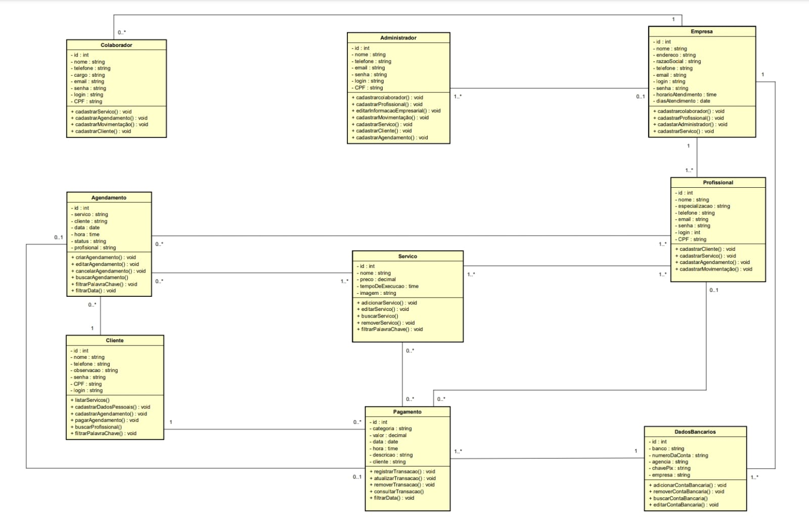

# Arquitetura da Solução

Definição de como o software é estruturado em termos dos componentes que fazem parte da solução e do ambiente de hospedagem da aplicação.

## Diagrama de Classes

O diagrama de classes ilustra graficamente como será a estrutura do software, e como cada uma das classes da sua estrutura estarão interligadas. Essas classes servem de modelo para materializar os objetos que executarão na memória.

Para uma melhor visualização do Modelo, disponibilizamos o PDF: [DiagramaDeClasses.pdf](https://github.com/ICEI-PUC-Minas-PMV-ADS/AGENDAHUB/blob/main/docs/img/Diagrama%20de%20classes.pdf)

## Modelo ER (Projeto Conceitual)

> - [Como fazer um diagrama entidade relacionamento | Lucidchart](https://www.lucidchart.com/pages/pt/como-fazer-um-diagrama-entidade-relacionamento)

## Projeto da Base de Dados

O projeto da base de dados corresponde à representação das entidades e relacionamentos identificadas no Modelo ER, no formato de tabelas, com colunas e chaves primárias/estrangeiras necessárias para representar corretamente as restrições de integridade.

Para uma melhor visualização do Modelo, disponibilizamos o PDF: [Diagrama_ER_AgendaHUB_BD_vs1.pdf](https://github.com/ICEI-PUC-Minas-PMV-ADS/AGENDAHUB/files/12708265/Diagrama_ER_AgendaHUB_BD_vs1.pdf)

## Tecnologias Utilizadas

### IDE (Ambiente de desenvolvimento integrado)
* Visual Studio Community 2022
  
### Front-end
* HTML
* CSS
* JavaScript
* Bootstrap

### Back-end
* ASP.NET
* C#
* SQL Server (Azure SQL)

### Estrutura
* MVC (Model, View and Controller)

### Versionamento de código
* GIT
