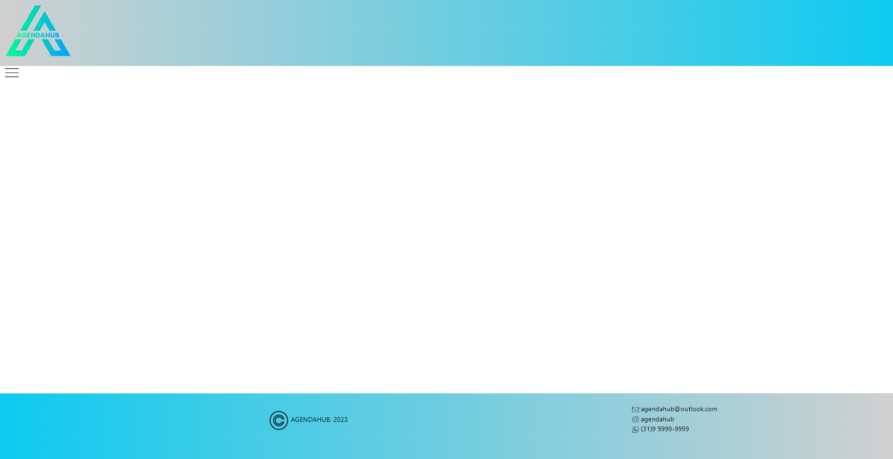
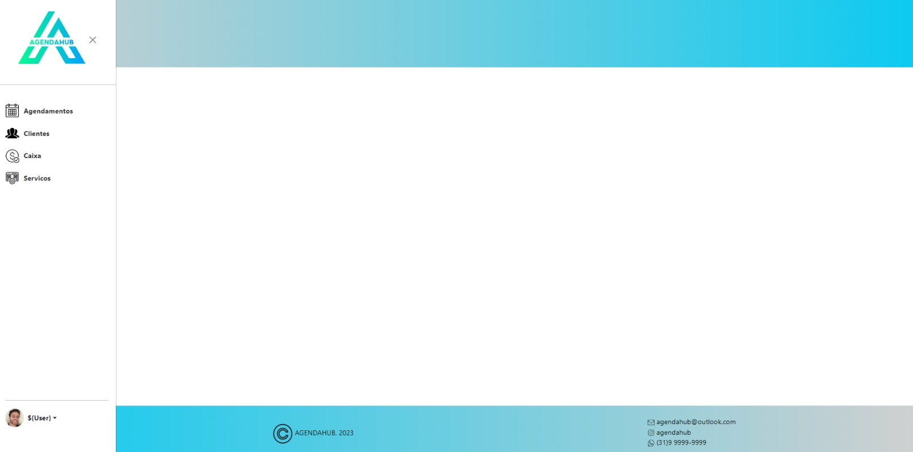
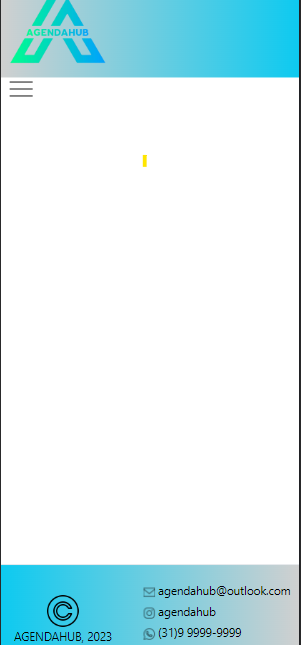
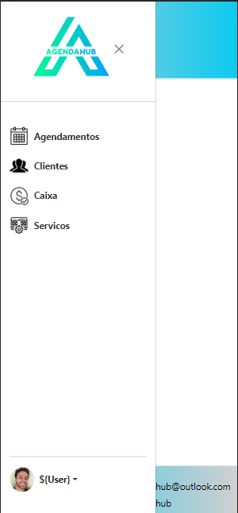

### Template Desktop

Esta apresentação destaca o template padrão do sistema, que inclui um header, um footer e um menu lateral, com um design atraente e amigável.

* O header do nosso sistema é a primeira impressão que os usuários têm. Ele apresenta um gradiente suave que incorpora as cores da marca, criando uma sensação de continuidade e profissionalismo.

* O footer complementa o header, mantendo o mesmo gradiente suave. Isso cria uma experiência coesa e agradável para os usuários, onde a marca é consistente em toda a aplicação.

* As cores usadas no template foram escolhidas com cuidado para criar uma experiência amigável para o usuário. Tons suaves e gradientes ajudam a reduzir a fadiga visual e tornar a aplicação mais atraente.

### Template Desktop com o Menu aberto

O menu lateral é uma parte essencial da navegação do sistema. Ele é projetado com um toque amigável, com ícones que tornam a navegação intuitiva e agradável.

### Template Responsivo
Garantir que o template seja igualmente funcional e atraente em dispositivos móveis é essencial.

  

### Template Responsivo com o Menu aberto

A versão responsiva do nosso template não apenas se adapta a diferentes dispositivos, mas também aprimora significativamente a usabilidade.

